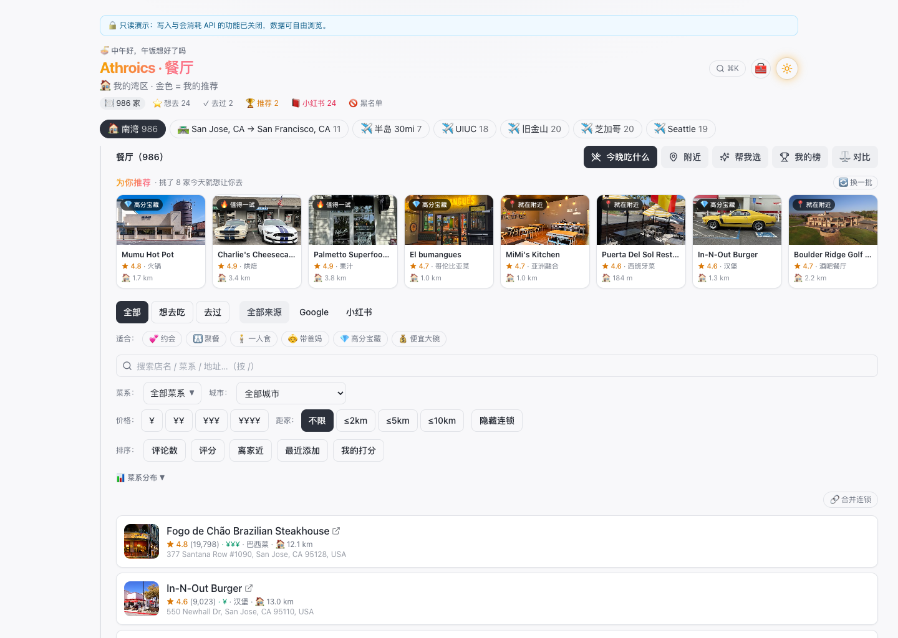
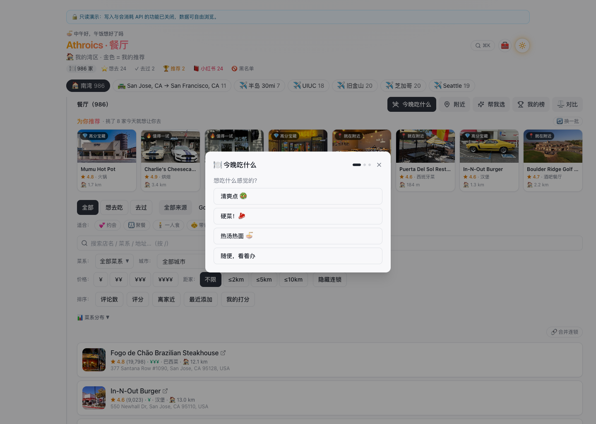
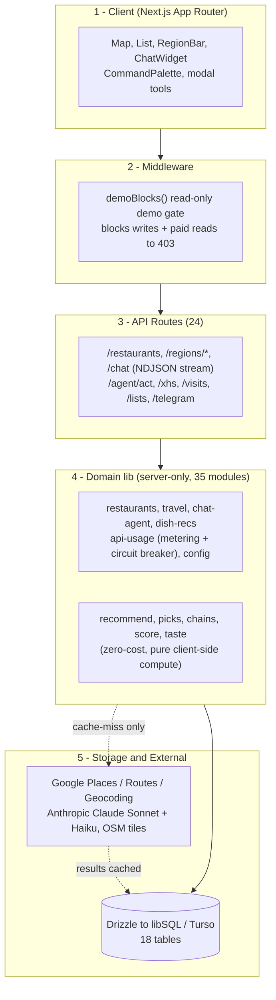
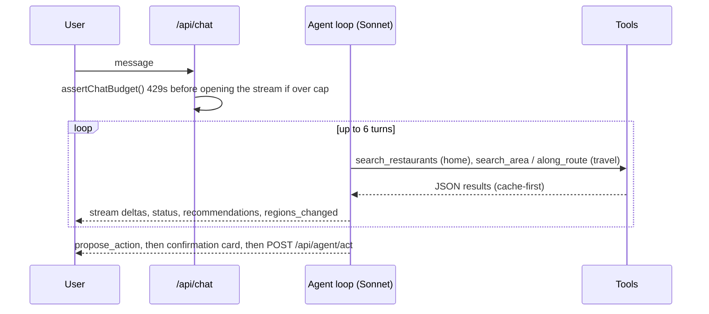

# 🍜 Athroics · Restaurant Picker

<samp><strong>English</strong> · <a href="README.zh.md">中文</a></samp>

**An AI-native restaurant companion for a Bay Area food lover** — discovers, ranks, and remembers ~1,000 curated restaurants across home turf and travel destinations, with a streaming conversational agent that recommends where to eat and can act on your behalf.

Built solo as a full-stack product: real external-API integrations (Google Places / Routes / Anthropic), an aggressive cache-everything data layer, hard cost circuit-breakers, and a tool-calling LLM agent — all shipped to production.

<p>
  
  
  
  
  
  
  
</p>

### 🔗 [**Live Demo →** restaurant-select-website.vercel.app](https://restaurant-select-website.vercel.app)

> The live site runs in **read-only demo mode** — browse the map, list, filters, menus, and reviews freely. Anything that would spend an API dollar or mutate data is blocked server-side, so it's safe to poke around. The UI is in Chinese (the app was built for a native-Chinese-speaking user); this README is in English.



---

## Why this project is interesting

This isn't a CRUD tutorial app. Every feature had to survive two hard constraints that shaped the whole architecture:

1. **Real money on every external call.** Google Places and Anthropic bill per request. The app treats API spend as a first-class resource — pre-flight budget checks, monthly hard caps, and a *cache-everything* rule so the same lookup is never paid for twice.
2. **A single real user with real taste.** No fake data, no lorem. Features are judged by whether they actually help someone decide where to eat tonight — which pushed the product toward an **AI agent**, a **taste model**, and **decision tools** rather than yet another list view.

The result is ~13,700 lines of TypeScript across a clean layered architecture: 24 API routes, 35 server-side domain modules, 26 React components, and an 18-table relational schema.

---

## Feature highlights

| Area | What it does |
|---|---|
| 🗺️ **Map + list** | Leaflet + OpenStreetMap with cuisine-emoji markers, clustering, and bi-directional list↔map linking (hover a card → highlight its marker; click → fly + open popup). |
| 🔍 **Discovery** | Grid-sampled Google Places sweep of the home region (rating/review thresholds), plus **travel discovery** by city, radius, real driving route (Routes API polyline), or hand-drawn map polygon. |
| 🤖 **Conversational agent** | A streaming, tool-calling Claude agent ("what should I eat near Stanford?", "find spots on the drive to Napa") that searches the user's own library, recommends clickable cards, and proposes write-actions behind a confirmation step. |
| ⭐ **Rate & remember** | 0–100 scoring, want-to-eat / visited tracking, a **taste profile** built from ratings, Elo-style **head-to-head ranking**, and AI-mined signature dishes from Google reviews. |
| 📕 **Xiaohongshu ingest** | Paste a link, text, or screenshot → Claude extracts restaurant names + review summaries + recommended dishes (vision for screenshots) → reverse-matched against Google Places → confirmed into the library. |
| 🎯 **Decision tools** | "Pick for me" (weighted random), compare 2–3 side-by-side, curated *For You* rail, nearby finder, shareable food cards, export lists — all **zero-API-cost, client-side**. |
| 📱 **Production polish** | Installable PWA with offline shell, light/dark theming (a cool-grey SaaS light mode + a starfield dark mode), URL-persisted view state, command palette (⌘K), full keyboard a11y, and a Telegram bot sharing the same agent brain. |

<p align="center">
  <br>
  <sub><em>The "what should I eat tonight?" guided pick — one of several zero-API-cost decision tools.</em></sub>
</p>

---

## Architecture



**Core principle:** external results are always written back to the DB. Repeat views hit the cache and cost `$0`. Every outbound call is wrapped in `assertUnderCap()` (pre-flight) and `recordUsage()` (post-call), metered in an `api_usage` table that backs a **hard $180/mo Google circuit-breaker** and a soft Anthropic cap.

---

## The AI agent, in depth

The conversational agent is the centerpiece. It's a **streaming tool-use loop** over Claude Sonnet, exposed to the browser as newline-delimited JSON so replies render token-by-token.



Things I'm proud of here:

- **Budget-safe streaming.** Once a stream opens you can only send `200`, so the budget check runs *before* the stream and returns a clean `429` when over cap.
- **Cache-first travel tools.** "What should I eat in Seattle?" reuses a cached region if it was searched in the last 30 days (zero spend); only a genuine cache-miss calls Google, capped at 2 paid searches per turn.
- **Write actions with a human in the loop.** The agent never mutates data directly — it emits a `propose_action` card; the user confirms, then a separate endpoint applies it.
- **One brain, two surfaces.** The same agent powers both the web widget (streaming) and a Telegram bot (a non-streaming wrapper).

---

## Engineering decisions worth calling out

- **Cost as an architectural constraint** — per-call metering, monthly hard caps, and a strict "cache every external result" rule. A one-time backfill of real photos for the entire library was a deliberate, budgeted spend; everything after is free to re-view.
- **Filter push-down** — restaurant queries push `region / visit / hidden / source` predicates into SQL `WHERE`/`HAVING` (backed by a `region_id` index) instead of scanning the full table into memory; the agent's tools request only the rows they need.
- **Race-condition guard** — rapid region/filter switching fires concurrent loads; a sequence-number ref ensures only the latest response is applied, so a slow stale request can't clobber fresh results.
- **Render-cost discipline** — map center lives in a `ref`, not state, so dragging the map doesn't re-render ~500 markers; cluster/`flyTo` interaction pitfalls are documented and worked around with `setView`.
- **Read-only demo mode** — a two-layer gate (server middleware + hidden client entry points) lets the project live publicly on the internet without anyone burning the owner's API budget.

---

## Tech stack

| Layer | Choice |
|---|---|
| Framework | Next.js 15 (App Router, RSC, TypeScript) |
| UI | Tailwind CSS + shadcn-style components, react-leaflet v5 + marker clustering |
| Data | Drizzle ORM over libSQL / **Turso** (local `file:` in dev, edge SQLite in prod) |
| External APIs | Google Places (New) · Routes · Geocoding; Anthropic Claude **Sonnet** (chat) + **Haiku** (extraction / vision) |
| Platform | Vercel (`standalone` output), PWA (manifest + service worker) |

---

## Data model

18 tables across six domains:

- **Core geo** — `regions`, `restaurants`, `visits`
- **Content** — `restaurant_menus`, `restaurant_reviews`, `dish_recs`, `restaurant_xhs`, `restaurant_photos`
- **Personal layer** — `lists`, `list_items`, `restaurant_tags`
- **AI chat** — `conversations`, `chat_messages` (recommendation cards persisted as JSON, restored on reopen)
- **Discovery / gamification** — `xhs_captures`, `dishes`, `duels`
- **Ops** — `api_usage` (cost ledger), `config`

Travel upserts deliberately **never reassign an existing restaurant's `region_id`**, so a new area search can't "steal" restaurants that already belong to home or another region.

---

## Getting started

```bash
npm install

cp .env.example .env
#  GOOGLE_PLACES_API_KEY and ANTHROPIC_API_KEY required
#  TURSO_* optional — leave blank to use a local file:./local.db

npm run db:push      # create tables
npm run db:seed      # seed config
npm run dev          # http://localhost:3000

npm run discover     # (optional) one-off Google Places sweep of the home region
```

Cost controls are on by default: `assertUnderCap()` guards every paid call, and a `DEMO_MODE=1` env flag flips the whole app read-only.

---

## Notes

Solo-built personal project — designed, architected, and shipped end to end: data modeling, external-API integration, the LLM agent, the front-end, deployment, and the cost/observability plumbing. It's module one of a larger personal-assistant system ("Athroics"); the schema and collector structure are laid out to grow.

<sub>Licensed under the terms in <a href="LICENSE">LICENSE</a>.</sub>
