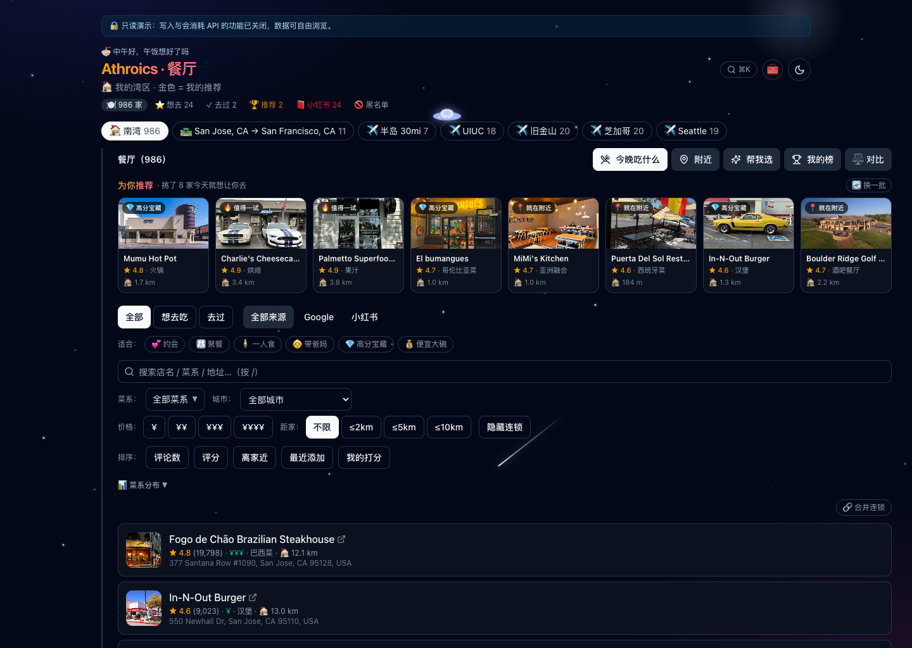
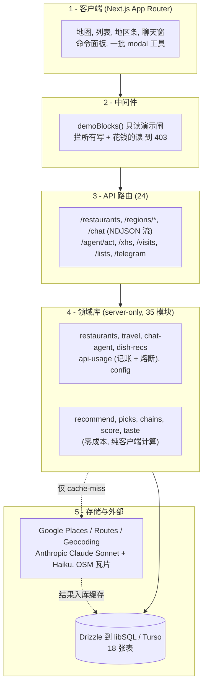
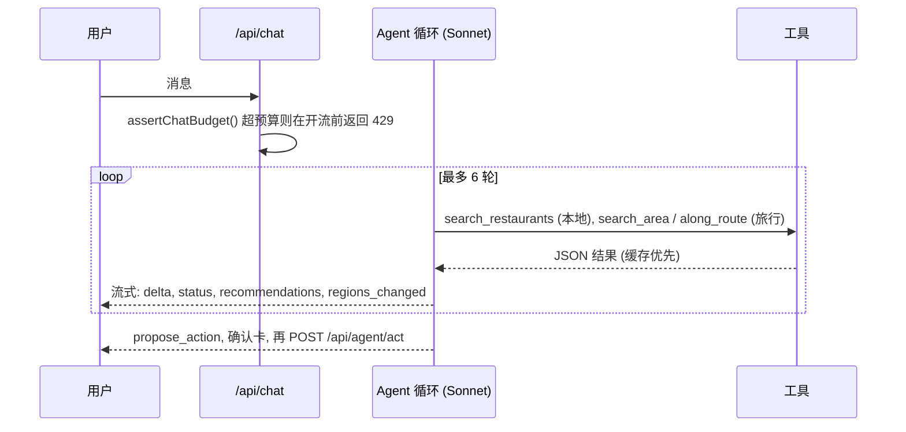

# 🍜 Athroics · 餐厅挑选系统

<samp><a href="README.md">English</a> · <strong>中文</strong></samp>

**一个为湾区美食爱好者打造的 AI 原生选餐系统** —— 在本地与旅行目的地之间发现、排序、记住约 1,000 家精选餐厅，配一个流式对话 Agent 帮你决定去哪吃、还能替你动手。

个人独立开发的全栈产品：真实的外部 API 集成（Google Places / Routes / Anthropic）、激进的「一切入库缓存」数据层、成本硬熔断，以及一个工具调用型 LLM Agent —— 全部已上线生产。

<p>
  
  
  
  
  
  
  
</p>

### 🔗 [**在线演示 →** zhefu-restaurant.vercel.app](https://zhefu-restaurant.vercel.app)

> 线上站点跑在**只读演示模式**：地图、列表、筛选、菜单、点评都能自由浏览，任何会花钱或改数据的操作都在服务端被拦截，可以放心点。界面为中文（本应用为一位母语中文的用户打造）。



<p align="center">
  <br>
  <sub><em>明暗双主题 —— 星空夜间模式 + 冷灰 SaaS 浅色模式，连地图瓦片都跟着切换。</em></sub>
</p>

---

## 这个项目有意思在哪

它不是一个 CRUD 教程 app。每个功能都得同时扛住两条硬约束，这两条约束塑造了整个架构：

1. **每次外部调用都在花真钱。** Google Places 和 Anthropic 按请求计费。应用把 API 花费当成一等资源来管 —— 调用前预检预算、月度硬上限、以及「一切入库缓存」的铁律，同一次查询绝不付费第二遍。
2. **只有一个真实用户、有真实口味。** 没有假数据、没有 lorem。功能的唯一评判标准是它是否真的帮到「今晚去哪吃」—— 这把产品推向了 **AI Agent**、**口味模型** 和 **决策工具**，而不是又一个列表视图。

成果是约 13,700 行 TypeScript，一套清晰的分层架构：24 个 API 路由、35 个服务端领域模块、26 个 React 组件、18 张表的关系型 schema。

---

## 功能亮点

| 领域 | 做了什么 |
|---|---|
| 🗺️ **地图 + 列表** | Leaflet + OpenStreetMap，菜系 emoji 图标 + 聚合；列表↔地图双向联动（悬停卡片高亮 marker，点击飞过去开弹窗）。 |
| 🔍 **发现** | 对本地地区做网格采样的 Google Places 扫描（评分/评论门槛），外加**旅行发现**：按城市、半径、真实驾车路线（Routes API polyline）、或手绘地图多边形。 |
| 🤖 **对话 Agent** | 流式、工具调用型的 Claude Agent（「斯坦福附近吃什么」「去 Napa 路上吃什么」）：在用户自己的库里搜索、给出可点击的推荐卡，写操作走「确认」再执行。 |
| ⭐ **打分 + 记忆** | 0–100 分制、想去吃 / 去过 追踪、基于打分的**口味画像**、Elo 式**两两排位**、从 Google 评论里 AI 挖掘的招牌菜。 |
| 📕 **小红书沉淀** | 贴链接 / 文字 / 截图 → Claude 提取店名 + 评价摘要 + 推荐菜（截图走 vision）→ 与 Google Places 反查匹配 → 确认入库。 |
| 🎯 **决策工具** | 帮我选（加权随机）、2–3 家并排对比、精选「为你推荐」栏、附近还有啥、分享美食卡、导出清单 —— **全部零 API 成本、纯客户端**。 |
| 📱 **工程打磨** | 可安装 PWA + 离线壳、明暗双主题（冷灰 SaaS 浅色 + 星空深色）、URL 持久化视图状态、命令面板（⌘K）、完整键盘无障碍，以及共用同一 Agent 大脑的 Telegram bot。 |

<p align="center">
  <br>
  <sub><em>「今晚吃什么」引导式选餐 —— 多个零 API 成本决策工具之一。</em></sub>
</p>

---

## 架构



**核心原则：** 外部结果一律写回数据库。重复浏览命中缓存、成本 `$0`。每次出站调用都包在 `assertUnderCap()`（调用前）和 `recordUsage()`（调用后）里，记进 `api_usage` 表，支撑 **$180/月 的 Google 硬熔断** 和一个 Anthropic 软上限。

---

## AI Agent 深入讲解

对话 Agent 是核心。它是一个跑在 Claude Sonnet 上的**流式工具调用循环**，以换行分隔的 JSON（NDJSON）暴露给浏览器，所以回复能逐字出现。



这里我比较得意的几点：

- **预算安全的流式。** 流一旦打开就只能发 `200`，所以预算检查放在开流**之前**，超上限时干净地返回 `429`。
- **缓存优先的旅行工具。** 「西雅图吃什么」若 30 天内搜过就直接复用缓存地区（零花费），只有真正 cache-miss 才调 Google，每轮上限 2 次付费搜索。
- **写操作留人在环。** Agent 从不直接改数据 —— 它发一张 `propose_action` 卡片，用户确认后，才由另一个端点执行。
- **一个大脑，两个入口。** 同一个 Agent 同时驱动网页气泡（流式）和 Telegram bot（非流式封装）。

---

## 值得一提的工程决策

- **把成本当架构约束** —— 逐调用记账、月度硬上限、以及严格的「一切外部结果入库缓存」规则。给全库一次性回填真实照片是一次有预算的、刻意的花费；之后再看都是免费的。
- **过滤下推** —— 餐厅查询把 `region / visit / hidden / source` 谓词下推到 SQL `WHERE`/`HAVING`（吃 `region_id` 索引），而不是把全表拉进内存过滤；Agent 的工具只取自己需要的行。
- **竞态守卫** —— 快速切换地区/筛选会并发多次加载；一个序号 ref 保证只应用最新一次响应，慢的旧请求无法覆盖新结果。
- **渲染成本纪律** —— 地图中心存在 `ref` 里而非 state，拖动地图不会重渲染约 500 个 marker；聚类与 `flyTo` 的交互坑都记录在案、用 `setView` 绕过。
- **只读演示模式** —— 服务端中间件 + 前端隐藏入口的两层闸，让项目能公开挂在互联网上，而不会有人烧掉作者的 API 预算。

---

## 技术栈

| 层 | 选型 |
|---|---|
| 框架 | Next.js 15（App Router, RSC, TypeScript） |
| UI | Tailwind CSS + shadcn 风格组件，react-leaflet v5 + marker 聚合 |
| 数据 | Drizzle ORM over libSQL / **Turso**（开发用本地 `file:`，生产用边缘 SQLite） |
| 外部 API | Google Places (New) · Routes · Geocoding；Anthropic Claude **Sonnet**（对话）+ **Haiku**（提取 / vision） |
| 平台 | Vercel（`standalone` 输出），PWA（manifest + service worker） |

---

## 数据模型

18 张表，分 6 个域：

- **核心地理** —— `regions`、`restaurants`、`visits`
- **内容沉淀** —— `restaurant_menus`、`restaurant_reviews`、`dish_recs`、`restaurant_xhs`、`restaurant_photos`
- **个人层** —— `lists`、`list_items`、`restaurant_tags`
- **AI 对话** —— `conversations`、`chat_messages`（推荐卡以 JSON 持久化，重开还原）
- **发现 / 游戏化** —— `xhs_captures`、`dishes`、`duels`
- **运维** —— `api_usage`（成本账本）、`config`

旅行 upsert 刻意**绝不改写已有餐厅的 `region_id`**，所以一次新的区域搜索不会把已归属 home 或别的地区的餐厅「抢走」。

---

## 快速开始

```bash
npm install

cp .env.example .env
#  必填 GOOGLE_PLACES_API_KEY 和 ANTHROPIC_API_KEY
#  TURSO_* 可留空 → 本地自动用 file:./local.db

npm run db:push      # 建表
npm run db:seed      # 初始化 config
npm run dev          # http://localhost:3000

npm run discover     # （可选）对本地地区跑一次 Google Places 扫描
```

成本控制默认开启：`assertUnderCap()` 守住每一次付费调用，一个 `DEMO_MODE=1` 环境变量把整个应用切成只读。

---

## 说明

个人独立项目 —— 从设计、架构到上线端到端完成：数据建模、外部 API 集成、LLM Agent、前端、部署，以及成本/可观测性的管道。它是一个更大的个人助理系统（「Athroics」）的第一个模块；schema 和采集器目录已按后续扩展留好位置。

<sub>许可见 <a href="LICENSE">LICENSE</a>。</sub>
